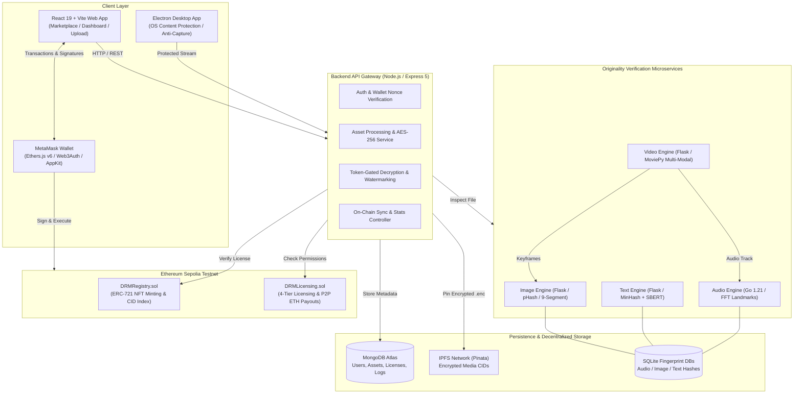
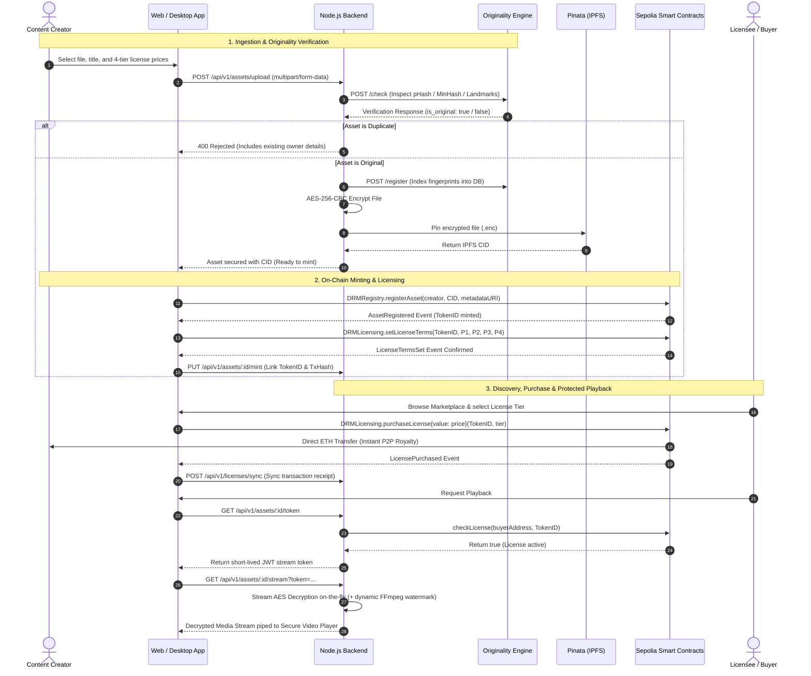
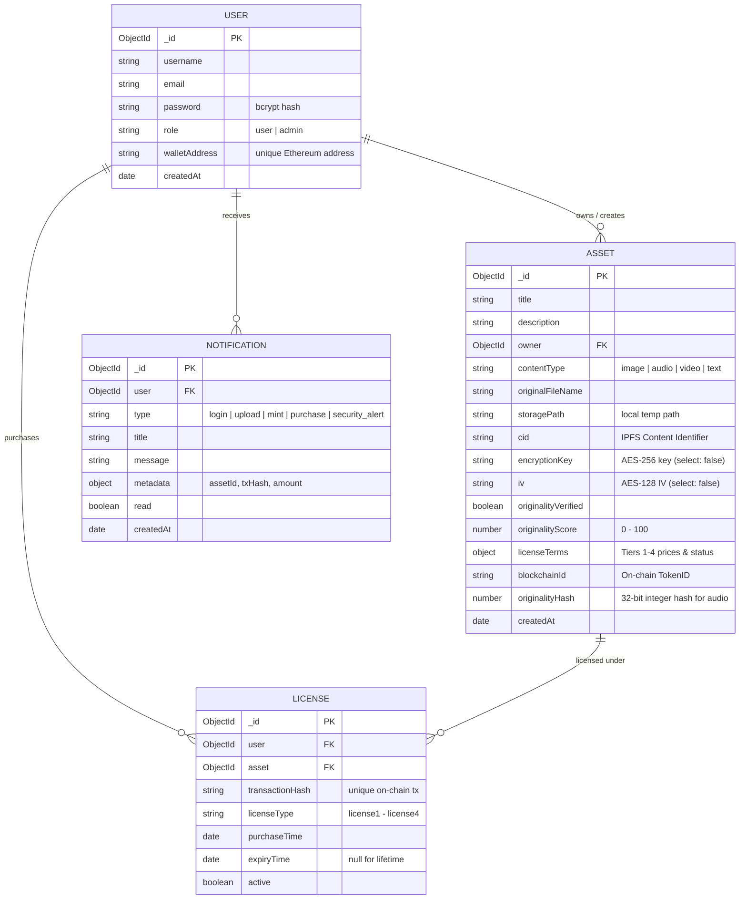

# Blockchain-Based Digital Rights Management (DRM)

> A full-stack, decentralized Digital Rights Management platform designed to protect intellectual property, prevent unauthorized distribution, and automate content licensing using multimodal originality verification, Ethereum smart contracts, and IPFS.

[](https://soliditylang.org/)
[](https://sepolia.etherscan.io/)
[](https://react.dev/)
[](https://nodejs.org/)
[](https://golang.org/)
[](https://python.org/)
[](https://pinata.cloud/)
[](https://www.electronjs.org/)

---

## Table of Contents
1. [Project Overview](#project-overview)
2. [Key Features](#key-features)
3. [System Architecture](#system-architecture)
4. [Multimodal Originality Engine](#multimodal-originality-engine)
5. [Application Flow](#application-flow)
6. [Tech Stack](#tech-stack)
7. [Project Structure](#project-structure)
8. [Database Architecture](#database-architecture)
9. [Smart Contracts & Licensing Model](#smart-contracts--licensing-model)
10. [Authentication & Security](#authentication--security)
11. [API Documentation](#api-documentation)
12. [Installation & Local Setup](#installation--local-setup)
13. [Testing](#testing)
14. [Deployment Configuration](#deployment-configuration)
15. [Visual Walkthrough & Screenshots](#visual-walkthrough--screenshots)
16. [Future Improvements](#future-improvements)
17. [Authors & Acknowledgments](#authors--acknowledgments)

---

## Project Overview

In the modern digital economy, unauthorized redistribution, automated scraping, and modification fraud cost digital creators billions annually. Traditional centralized Digital Rights Management (DRM) systems suffer from single points of failure, non-transparent royalty accounting, and vulnerability to basic circumvention (such as rotation, cropping, paraphrasing, or pitch-shifting). Furthermore, the proliferation of generative AI has made proving initial provenance and ownership increasingly difficult.

**Blockchain-Based DRM** addresses this crisis through a hybrid decentralized architecture. Before any digital asset can be registered on-chain, it is analyzed by a dedicated **Multimodal Originality Engine** spanning images, audio, video, and text. Assets verified as original are encrypted at rest using **AES-256-CBC**, pinned to the **IPFS** decentralized network, and tokenized as **ERC-721 NFTs** on the **Ethereum Sepolia Testnet**.

Rights holders can define flexible, programmable multi-tier licensing terms (e.g., view-only, time-delimited access, full reproduction, or AI model training). Consumers purchase licenses directly through smart contracts with zero intermediaries, transferring native ETH directly to the creator. Licensed content is delivered through **token-gated streaming** with on-the-fly AES decryption, dynamic watermarking via FFmpeg, and an **anti-capture Electron desktop client** that disables screen recording and screenshot tools at the OS level.

---

## Key Features

* **Multimodal Originality Verification**:
  * **Images**: Discrete Cosine Transform (DCT) Perceptual Hashing (64-bit pHash) combined with 4-angle rotational sweeps (0°, 90°, 180°, 270°), horizontal mirroring, and 9 spatial segmentations (halves and quadrants) to catch cropped duplicates.
  * **Text**: Dual-layer analysis combining syntactic MinHash (128 permutations, 3-word n-gram shingling, Jaccard similarity) and deep semantic embedding analysis via Sentence-BERT (`all-MiniLM-L6-v2` cosine similarity) for detecting paraphrasing and AI rewrites across `.txt`, `.pdf`, and `.docx`.
  * **Audio**: High-performance Go microservice computing Fast Fourier Transform (FFT) spectrograms to extract peak spectral landmarks (Shazam-style fingerprinting) with time-offset matching.
  * **Video**: Frame-and-audio extraction via `moviepy`, dispatching keyframes to the image pHash engine and audio tracks to the Go spectral engine for weighted multi-modal synthesis.
* **On-Chain Copyright Registry (ERC-721)**:
  * Immutable asset registration on Ethereum Sepolia (`DRMRegistry.sol`) linking cryptographic content hashes (CIDs) to token IDs.
  * On-chain deduplication preventing duplicate registration of already registered content hashes.
* **Programmable Multi-Tier Smart Licensing**:
  * Smart contract (`DRMLicensing.sol`) managing 4 granular license tiers per asset with customized pricing.
  * Direct peer-to-peer (P2P) ETH settlement—100% of license fees are dispatched immediately to the creator's wallet.
* **Decentralized Encrypted Storage**:
  * Client-side/edge file encryption using **AES-256-CBC** with cryptographically secure random keys and initialization vectors (IVs).
  * Distributed persistence via **IPFS** pinned through **Pinata** cloud gateways.
* **Secure, Token-Gated Content Delivery**:
  * Short-lived (1-hour), HMAC-signed JWT stream tokens verified against on-chain contract licenses or database records.
  * Real-time decipher piping (`crypto.createDecipheriv`) streaming content without storing decrypted files on disk.
  * On-the-fly dynamic video watermarking using `fluent-ffmpeg` (`drawtext` filter).
* **Anti-Screen-Recording Desktop Client**:
  * Dedicated Electron desktop application enforcing `setContentProtection(true)` to prevent operating system screen recording and screenshots.
  * Disabled context menus, isolated preload contexts, and restricted navigation.
* **Web3 & Web2 Unified Authentication**:
  * Email/password authentication with bcrypt hashing (10 rounds) and JWT sessions.
  * Nonce-based cryptographic wallet linking with MetaMask via `ethers.verifyMessage`.
* **Creator Marketplace & Real-Time Analytics**:
  * Paginated asset marketplace with title search and MIME type filtering.
  * Live dashboard monitoring sales revenue, license counts, and real-time Ethereum Sepolia on-chain stats.

---

## System Architecture



### Component Responsibilities

| Component | Technology | Primary Responsibility |
| :--- | :--- | :--- |
| **Frontend Client** | React 19, Tailwind CSS, Vite | Responsive UI for asset upload, originality inspection, marketplace, dashboard, and Web3 interactions. |
| **Desktop Client** | Electron 31, Node.js | Hardened playback environment with hardware window protection (`setContentProtection(true)`) preventing screen scraping. |
| **Backend API** | Node.js, Express 5, Mongoose | Orchestrates upload pipelines, interacts with originality microservices, performs AES-256 encryption, issues stream JWTs, and interacts with Ethereum RPC. |
| **Originality Engine** | Python (Flask), Go 1.21 | Independent microservices executing algorithmic deduplication (pHash, MinHash, SBERT embeddings, spectral audio landmarks). |
| **Smart Contracts** | Solidity 0.8.20, Hardhat | Maintains non-fungible ownership records (`DRMRegistry`) and manages non-custodial licensing transactions with instant ETH transfers (`DRMLicensing`). |
| **Decentralized Storage** | Pinata (IPFS) | Globally distributes encrypted binary assets indexed by Content Identifiers (CIDs). |
| **Primary Database** | MongoDB Atlas | Off-chain store for user records, asset metadata, encrypted keys, notification logs, and cached sales metrics. |

---

## Multimodal Originality Engine

The platform implements dedicated, non-trivial deduplication algorithms tailored to each media category:

```
                            ┌──────────────────────────────────────────────┐
                            │            Uploaded File Stream              │
                            └──────────────────────┬───────────────────────┘
                                                   │
         ┌─────────────────────┬───────────────────┴───────────────────┬─────────────────────┐
         ▼                     ▼                                       ▼                     ▼
   ┌───────────┐         ┌───────────┐                           ┌───────────┐         ┌───────────┐
   │   IMAGE   │         │   TEXT    │                           │   AUDIO   │         │   VIDEO   │
   └─────┬─────┘         └─────┬─────┘                           └─────┬─────┘         └─────┬─────┘
         │                     │                                       │                     │
   • Resize 32x32        • 3-Word Shingles                       • FFT Spectrogram     • Extract Audio
   • DCT Matrix          • 128 MinHash perms                     • Peak Extraction     • Sample Keyframes
   • 64-bit pHash        • Jaccard Similarity                    • Landmark Pairs      • Delegate to Img
   • 4 Rotations + Flip  • SBERT `all-MiniLM-L6-v2`              • Time-offset Hash      & Audio Engines
   • 9 Spatial Segments  • Cosine Similarity                     • SQLite Search       • Weighted Synthesis
         │                     │                                       │                     │
         └─────────────────────┴───────────────────┬───────────────────┴─────────────────────┘
                                                   │
                                     ┌─────────────┴─────────────┐
                                     ▼                           ▼
                              [ Duplicate ]                [ Original ]
                           Reject & Reveal Owner       Encrypt & Proceed to Mint
```

1. **Image Engine (`imagehash`, PIL)**: Computes a 64-bit DCT perceptual hash. Compares Hamming distance across normal, mirrored, and 90°/180°/270° orientations. Additionally crops 9 regions (full, halves, quadrants) to detect cropped reuse. Any Hamming distance $\le 10$ triggers duplicate rejection.
2. **Text Engine (`datasketch`, `sentence-transformers`, `pypdf`, `python-docx`)**:
   * *Syntactic Layer*: Computes MinHash signatures over 3-word n-gram shingles with 128 permutations. Flags exact/near-duplicates when Jaccard Similarity exceeds 0.95.
   * *Semantic Layer*: Encodes text using the SBERT `all-MiniLM-L6-v2` transformer. Computes cosine similarity between dense sentence embeddings; flags semantic paraphrasing and AI rewrites when similarity exceeds 0.85.
3. **Audio Engine (`Go 1.21`, SQLite3)**: Implements an FFT-based spectral peak landmark extraction algorithm. Converts audio into frequencies over time, generates anchor hashes from peak constellations, and matches time-offset sequences against an indexed SQLite database.
4. **Video Engine (`moviepy`, requests)**: Splits video into audio tracks and keyframe snapshots. Dispatches audio to the Go engine and keyframes to the image pHash engine. Synthesizes a composite originality score ($>20\%$ visual frame match or audio landmark match flags duplication).

---

## Application Flow



---

## Tech Stack

| Category | Technology | Purpose in Project |
| :--- | :--- | :--- |
| **Frontend** | React 19, Vite 7 | High-performance Single Page Application interface |
| **Styling & Icons** | Tailwind CSS 3.4, Lucide React, Framer Motion | Modern dark-mode UI, animations, and icons |
| **Web3 & Wallet** | Ethers.js v6, `@reown/appkit`, `@web3auth` | Web3 wallet connection, signing, and contract interactions |
| **Desktop App** | Electron 31, `electron-builder` | Protected desktop client with OS window capture blocking |
| **Backend** | Node.js, Express 5 | REST API, streaming gateway, security middleware |
| **Database** | MongoDB Atlas, Mongoose 9 | Primary application datastore for users, assets, and licenses |
| **Local Cache/DB** | SQLite3 | Local persistent storage for binary fingerprints & pHash tables |
| **Blockchain** | Solidity 0.8.20, Hardhat, OpenZeppelin | ERC-721 token registry and multi-tier licensing smart contracts |
| **Testnet** | Ethereum Sepolia Testnet | Public test network deployment and contract verification |
| **Cryptography** | Node.js `crypto` (AES-256-CBC) | Symmetric encryption of assets prior to decentralized upload |
| **Decentralized Storage**| IPFS via Pinata Cloud API | Decentralized, immutable content storage via CIDs |
| **AI / NLP Engine** | Python 3.10+, PyTorch, Sentence-Transformers | SBERT `all-MiniLM-L6-v2` semantic text duplicate detection |
| **Image Fingerprinting**| `imagehash`, Pillow | 64-bit DCT perceptual hash with 9-region spatial decomposition |
| **Audio Fingerprinting**| Go 1.21, SQLite3 | Fast Fourier Transform peak landmark matching engine |
| **Video Processing** | `moviepy`, `fluent-ffmpeg` | Audio/frame decomposition and on-the-fly streaming watermarks |
| **DevOps & Hosting** | Docker, Render, Netlify | Containerized microservice deployment and cloud hosting |

---

## Project Structure

```text
blockchain-based-drm/
├── backend/                        # Node.js + Express REST API & Streaming Server
│   ├── src/
│   │   ├── config/                 # MongoDB database connection
│   │   ├── controllers/            # Asset, Auth, License, Stream, Notification controllers
│   │   ├── middleware/             # JWT auth protection and Multer disk upload
│   │   ├── models/                 # Mongoose models (Asset, License, Notification, User)
│   │   ├── routes/                 # Express API routes
│   │   ├── services/               # AES-256 encryption, IPFS (Pinata), and Originality connectors
│   │   └── app.js                  # Express app setup and middleware configuration
│   ├── server.js                   # Server entry point (Port 5000 / 10000)
│   ├── Dockerfile                  # Container definition for backend service
│   └── package.json
│
├── blockchain/                     # Ethereum Smart Contracts & Hardhat Environment
│   ├── contracts/
│   │   ├── DRMRegistry.sol         # ERC-721 NFT minting contract with CID deduplication
│   │   └── DRMLicensing.sol        # 4-tier programmable license contract with P2P payouts
│   ├── scripts/
│   │   └── deploy.js               # Deployment script for Ethereum Sepolia testnet
│   ├── test/
│   │   └── DRM.test.js             # Automated contract test suite (Chai / Ethers)
│   ├── hardhat.config.js           # Hardhat network and compiler configuration
│   └── package.json
│
├── frontend/                       # React 19 + Vite Web Application
│   ├── src/
│   │   ├── abi/                    # Contract ABIs for DRMRegistry and DRMLicensing
│   │   ├── components/             # Reusable UI components, Navbar, Sidebar, SecurityWrapper
│   │   ├── context/                # AuthContext (JWT + MetaMask Ethers v6 integration)
│   │   ├── lib/                    # Axios API client, license configurations, utility helpers
│   │   ├── pages/                  # Landing, Dashboard, Marketplace, Upload, AssetDetails, etc.
│   │   ├── App.jsx                 # Route definitions (Public & Protected Dashboard)
│   │   └── main.jsx
│   ├── netlify.toml                # Netlify SPA redirect rules
│   ├── tailwind.config.js
│   └── package.json
│
├── desktop/                        # Electron Desktop Application
│   ├── main.js                     # Electron process with setContentProtection(true)
│   ├── preload.js                  # Secure preload script with context isolation
│   └── package.json                # Electron configuration and build targets
│
├── originality-engine/             # Multimodal Originality Microservices
│   ├── audioFiles/                 # Go-based Shazam-style spectral landmark engine
│   │   ├── db/                     # SQLite schema and query logic
│   │   ├── shazam/                 # Peak extraction and spectrogram processing
│   │   ├── main.go                 # HTTP server (:8080) handling /check and /register
│   │   ├── Dockerfile
│   │   └── go.mod
│   ├── imageFiles/                 # Python Flask image pHash engine (:8081)
│   │   ├── originality.py          # 9-segment DCT pHash with 4-orientation sweep
│   │   ├── main.py                 # Flask endpoints for /check, /register, and /health
│   │   └── Dockerfile
│   ├── textFiles/                  # Python Flask text MinHash + SBERT engine (:5002)
│   │   ├── originality.py          # Datasketch MinHash + Sentence-Transformers SBERT
│   │   ├── server.py               # Flask endpoints for text document verification
│   │   └── Dockerfile
│   ├── videoFiles/                 # Python Flask video multi-modal coordinator (:5003)
│   │   ├── originality.py          # MoviePy decomposition and multi-engine synthesis
│   │   └── server.py               # Video verification API
│   ├── requirements.txt            # Python dependencies
│   └── start_servers.py            # Local orchestration script to launch all engines
│
├── Project Images/                 # Screenshots demonstrating system execution
├── documentation/                  # Academic project report and LaTeX source files
└── render.yaml                     # Render Blueprints multi-service deployment spec
```

---

## Database Architecture

The system utilizes MongoDB Atlas for application state, alongside embedded SQLite databases inside each originality engine for localized fingerprint lookup.



---

## Smart Contracts & Licensing Model

### Deployed Contracts (Ethereum Sepolia Testnet)

* **DRMRegistry**: [`0xA9A86c2D0C46BFB5f9daABFc8364D044E6A20512`](https://sepolia.etherscan.io/address/0xA9A86c2D0C46BFB5f9daABFc8364D044E6A20512)
  * Inherits from OpenZeppelin `ERC721URIStorage` and `Ownable`.
  * `registerAsset(address to, string contentHash, string metadataURI)` mints an NFT to the creator and verifies that the `contentHash` has not been previously registered.
* **DRMLicensing**: [`0x9f0ec638885dEb4973386554439AD81B9ec40fC8`](https://sepolia.etherscan.io/address/0x9f0ec638885dEb4973386554439AD81B9ec40fC8)
  * Interacts with `DRMRegistry` to verify token creator authority.
  * `setLicenseTerms(uint256 tokenId, uint256 l1Price, uint256 l2Price, uint256 l3Price, uint256 l4Price)` sets prices in Wei for the 4 tiers.
  * `purchaseLicense(uint256 tokenId, string licenseType)` accepts ETH payments via `payable`, executes an instant transfer of funds directly to the asset creator's address (`payable(creator).transfer(msg.value)`), and records the license.
  * `checkLicense(address user, uint256 tokenId)` returns a boolean verifying valid on-chain access rights and checking expiration timestamps.

### Granular License Matrix

| Media Type | Tier 1 (`license1`) | Tier 2 (`license2`) | Tier 3 (`license3`) | Tier 4 (`license4`) |
| :--- | :--- | :--- | :--- | :--- |
| **Image** | View-Only (No Download) | Time-Limited (24 Hours) | Downloadable Original | Commercial / Derivative |
| **Audio** | One-Time Playback | Limited-Time (24 Hours) | Downloadable Track | Commercial Sync License |
| **Video** | One-Time Viewing | Limited Access (24 Hours) | Downloadable MP4 | Commercial Broadcast |
| **Text** | Read-Only (No Copy) | Quotation Excerpt | Full Reproduction | AI / Model Training License |

---

## Authentication & Security

1. **Password Hashing & JWT Sessions**: User passwords are encrypted with `bcryptjs` using 10 salt rounds. On successful login, the server issues a JSON Web Token signed with `JWT_SECRET` expiring in 30 days.
2. **Cryptographic Nonce-Based Wallet Authentication**: To associate a Web3 wallet, the client requests a signature from MetaMask for a custom verification message. The backend uses `ethers.verifyMessage(message, signature)` to cryptographically recover the signer address and ensure ownership without relying on client-supplied claims.
3. **AES-256-CBC Envelope Encryption**: Raw files uploaded by creators are encrypted at rest using AES-256 in Cipher Block Chaining mode with unique 256-bit keys and 128-bit IVs generated via `crypto.randomBytes()`. Only the encrypted `.enc` file is uploaded to IPFS. Keys and IVs are marked with `select: false` in Mongoose and never exposed via standard queries.
4. **Token-Gated Decrypted Streaming**: Access to media requires calling `GET /api/v1/assets/:id/token`. The backend checks both database licenses and on-chain contract state via JSON-RPC. If verified, a 1-hour single-use token is issued. During streaming, the backend retrieves the encrypted file from local storage or the Pinata IPFS gateway, deciphers it on-the-fly using `crypto.createDecipheriv`, and pipes the raw stream directly to the HTTP response.
5. **Dynamic Video Watermarking**: When enabled, the backend pipes the deciphered video stream through `fluent-ffmpeg`, applying an ultrafast `drawtext` video filter containing dynamic license labels to deter unauthorized screen recording.
6. **Anti-Capture OS Sandbox (Desktop App)**: The Electron client invokes Chromium's native `mainWindow.setContentProtection(true)` API. On Windows and macOS, this instructs the OS compositor to render the window content as black in screen sharing tools, screen recording software (OBS, QuickTime), and screenshot utilities.

---

## API Documentation

All routes are prefixed with `/api/v1`. Protected endpoints require an `Authorization: Bearer <JWT_TOKEN>` header.

### Authentication Endpoints

| Method | Endpoint | Description | Auth Required |
| :--- | :--- | :--- | :--- |
| `POST` | `/auth/register` | Register a new user account | No |
| `POST` | `/auth/login` | Authenticate user and obtain JWT | No |
| `GET` | `/auth/me` | Fetch profile of currently authenticated user | **Yes** |
| `PUT` | `/auth/connect-wallet` | Verify signature and link MetaMask wallet | **Yes** |
| `PUT` | `/auth/disconnect-wallet` | Unlink connected wallet address | **Yes** |

### Asset Management Endpoints

| Method | Endpoint | Description | Auth Required |
| :--- | :--- | :--- | :--- |
| `GET` | `/assets` | List verified marketplace assets (supports search, sort, pagination) | No |
| `POST` | `/assets/upload` | Upload new media file and initialize originality verification | **Yes** |
| `POST` | `/assets/check` | Public utility to test originality without registering an asset | No |
| `GET` | `/assets/:id` | Retrieve detailed metadata for a single asset | No |
| `PUT` | `/assets/:id/verify` | Trigger originality engine analysis on an uploaded asset | **Yes** |
| `PUT` | `/assets/:id/secure` | Encrypt asset with AES-256 and upload to IPFS via Pinata | **Yes** |
| `PUT` | `/assets/:id/mint` | Update asset record with on-chain TokenID and transaction hash | **Yes** |
| `GET` | `/assets/:id/token` | Request a short-lived (1h) token for media streaming | **Yes** |
| `GET` | `/assets/:id/stream` | Stream decrypted media on-the-fly (requires `?token=...`) | Token Required |

### Licensing & Analytics Endpoints

| Method | Endpoint | Description | Auth Required |
| :--- | :--- | :--- | :--- |
| `POST` | `/licenses/sync` | Sync on-chain license purchase to database | **Yes** |
| `GET` | `/licenses/me` | List active licenses owned by the authenticated user | **Yes** |
| `GET` | `/licenses/stats` | Creator sales and revenue metrics for owned assets | **Yes** |
| `GET` | `/licenses/public-stats` | Aggregated platform metrics (total assets, revenue) | No |
| `GET` | `/licenses/blockchain-stats`| Real-time Sepolia on-chain stats (total minted, total sales) | No |
| `GET` | `/dashboard/stats` | Consolidated dashboard statistics for current user | **Yes** |
| `GET` | `/notifications` | Retrieve user notification history | **Yes** |

---

## Installation & Local Setup

### Prerequisites

* **Node.js**: v18.0.0 or v20.x
* **Python**: v3.10 or v3.11
* **Go**: v1.21 or higher
* **MongoDB**: Local MongoDB community instance or MongoDB Atlas URI
* **FFmpeg**: Installed and available in your system `PATH`
* **MetaMask**: Browser extension configured for the Ethereum Sepolia Testnet

### 1. Clone Repository

```bash
git clone https://github.com/Saikrishna-Bathina/blockchain-based-drm.git
cd blockchain-based-drm
```

### 2. Environment Variables Configuration

#### Backend Configuration (`backend/.env`)
Create a `.env` file in the `backend/` directory:

```env
PORT=5000
NODE_ENV=development
MONGO_URI=mongodb://localhost:27017/blockchain-drm
JWT_SECRET=your_super_secret_jwt_key_min_32_chars
JWT_EXPIRE=30d

# Ethereum Sepolia Configuration
RPC_URL=https://eth-sepolia.g.alchemy.com/v2/YOUR_ALCHEMY_KEY
DRM_REGISTRY_ADDRESS=0xA9A86c2D0C46BFB5f9daABFc8364D044E6A20512
DRM_LICENSING_ADDRESS=0x9f0ec638885dEb4973386554439AD81B9ec40fC8

# Pinata IPFS Credentials
PINATA_API_KEY=your_pinata_api_key
PINATA_SECRET_KEY=your_pinata_secret_key

# Originality Microservices URLs
ENGINE_IMAGE_URL=http://localhost:8081
ENGINE_TEXT_URL=http://localhost:5002
ENGINE_AUDIO_URL=http://localhost:8080
ENGINE_VIDEO_URL=http://localhost:5003
```

#### Blockchain Configuration (`blockchain/.env`)
Create a `.env` file in the `blockchain/` directory:

```env
SEPOLIA_RPC_URL=https://eth-sepolia.g.alchemy.com/v2/YOUR_ALCHEMY_KEY
PRIVATE_KEY=your_wallet_private_key_without_0x_prefix
```

#### Frontend Configuration (`frontend/.env`)
Create a `.env` file in the `frontend/` directory:

```env
VITE_API_BASE_URL=http://localhost:5000/api/v1
```

---

### 3. Install Dependencies & Run

#### A. Start Originality Engines (Python & Go)

```bash
# 1. Install Python engine dependencies
cd originality-engine
pip install -r requirements.txt

# 2. Build and start the Go audio engine
cd audioFiles
go run main.go check.go register.go
# Audio Engine runs on http://localhost:8080

# 3. In separate terminals, start Image, Text, and Video engines:
# Image Engine (:8081)
cd ../imageFiles && python main.py

# Text Engine (:5002)
cd ../textFiles && python server.py

# Video Engine (:5003)
cd ../videoFiles && python server.py
```
*(Alternatively, execute `python start_servers.py` from the `originality-engine` directory to launch all Python services).*

#### B. Start Backend API

```bash
cd backend
npm install
npm run start
# Backend API runs on http://localhost:5000
```

#### C. Start Frontend Application

```bash
cd frontend
npm install
npm run dev
# Vite dev server runs on http://localhost:5173
```

#### D. (Optional) Run Secure Desktop App

```bash
cd desktop
npm install
npm run dev
```

---

## Testing

The repository contains automated unit and integration tests for smart contracts, as well as test scripts for originality engines and backend services.

### Smart Contract Test Suite

Smart contract test suites are written with **Mocha**, **Chai**, and **Hardhat Network**:

```bash
cd blockchain
npx hardhat test
```

**Tested Scenarios**:
* Asset registration on `DRMRegistry`, verifying ERC-721 token minting, URI assignment, and deduplication logic.
* Setting four-tier license pricing terms on `DRMLicensing`.
* Purchasing a license with simulated ETH value transfers.
* Verifying `checkLicense()` validity conditions.

### Originality & Backend Verification Scripts

```bash
# Test Text Originality server and SBERT semantic duplicate evaluation
cd originality-engine/textFiles
python verify_server.py

# Test Video Originality multi-modal keyframe and audio extraction
cd originality-engine/videoFiles
python test_video_registration.py

# Run Backend IPFS Pinning and API diagnostics
cd backend
node test_ipfs.js
node test_api.js
node verify_blockchain.js
```

---

## Deployment Configuration

The repository includes ready-to-use production deployment manifests:

### 1. Cloud Microservices (`render.yaml`)
A complete multi-container specification for **Render**:
* `drm-audio-engine`: Dockerized Go 1.21 binary serving port 8080.
* `drm-image-engine`: Dockerized Flask service with PIL and `imagehash`.
* `drm-text-engine`: Dockerized Flask service with PyTorch and Sentence-Transformers (`ENABLE_SEMANTIC_CHECK=true`).
* `drm-video-engine`: Dockerized Flask service linking directly to the image and audio engines.
* `drm-backend`: Dockerized Node.js service connecting to MongoDB Atlas, Pinata, and the four internal originality engine hostnames.

### 2. Single Page Application (`frontend/netlify.toml`)
Configures client-side routing fallback for Netlify hosting:

```toml
[[redirects]]
  from = "/*"
  to = "/index.html"
  status = 200
```

---

## Visual Walkthrough & Screenshots

The platform end-to-end user workflow captured during live testing on the Ethereum Sepolia testnet:

| 1. Landing Page | 2. User Authentication |
| :---: | :---: |
|  |  |
| *Platform overview and feature showcase* | *Email/password authentication with JWT* |

| 3. Creator Dashboard | 4. Web3 Wallet Connection |
| :---: | :---: |
|  |  |
| *Revenue metrics, recent assets, and licensing stats* | *MetaMask cryptographic nonce signature verification* |

| 5. Upload & License Pricing | 6. Originality Verification |
| :---: | :---: |
|  |  |
| *Drag-and-drop upload and 4-tier price definition* | *pHash, MinHash, and audio spectral scanning* |

| 7. Blockchain Minting | 8. MetaMask Approval |
| :---: | :---: |
|  |  |
| *AES-256 encrypted file pinned to IPFS CID* | *Signing ERC-721 registerAsset transaction* |

| 9. Minting Confirmation | 10. Digital Content Marketplace |
| :---: | :---: |
|  |  |
| *TokenID and on-chain transaction receipt* | *Browsing verified assets with filter and search* |

| 11. Purchasing a License | 12. P2P Royalty Transfer |
| :---: | :---: |
|  |  |
| *Selecting license tier and executing smart contract* | *Direct ETH transfer to creator's wallet via contract* |

---

## Future Improvements

* **Zero-Knowledge (ZK) Proofs for Originality**: Implement zk-SNARKs to prove an asset's originality against a fingerprint database without revealing proprietary media contents during verification.
* **Layer-2 Rollup Migration (Arbitrum / Base)**: Deploy licensing contracts onto an Ethereum Layer 2 network to reduce gas fees for micro-licensing transactions (e.g., single-playback licenses).
* **Decentralized Streaming Nodes**: Transition backend streaming proxy to decentralized video delivery networks (such as Livepeer or Filecoin Saturn) to eliminate centralized bandwidth bottlenecks.
* **Automated Dispute Resolution DAO**: Implement an on-chain arbitration protocol for copyright dispute resolution where staked validators audit flagged near-duplicate content.

---

## Authors & Acknowledgments

Developed as a Final-Year Capstone Project for the award of the Degree of **Bachelor of Technology in Computer Science & Engineering** (2021–2025) at **JNTU-GV College of Engineering, Vizianagaram (A)**.

### Project Team

* **G. Dharani** (21VV1A0518)
* **P. Yateesha** (21VV1A0538)
* **S. Phani Sai Prasad** (21VV1A0546)
* **S. Ramesh** (21VV1A0552)

### Project Lead & Maintainer

* **Saikrishna Bathina** — [GitHub Profile](https://github.com/Saikrishna-Bathina)

### Under the Guidance of

* **Mr. V. Laxmi Prasad (C)**, Assistant Professor, Department of Computer Science & Engineering, JNTU-GV, CEV (A).
