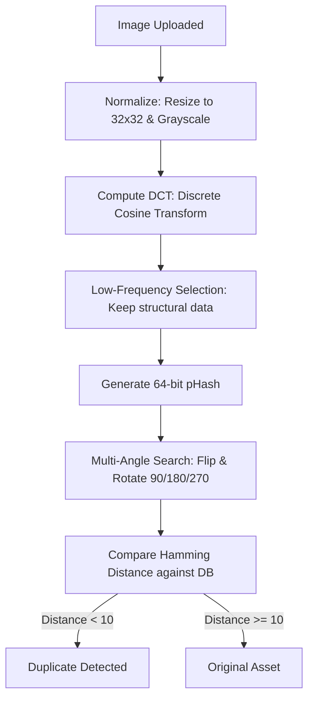
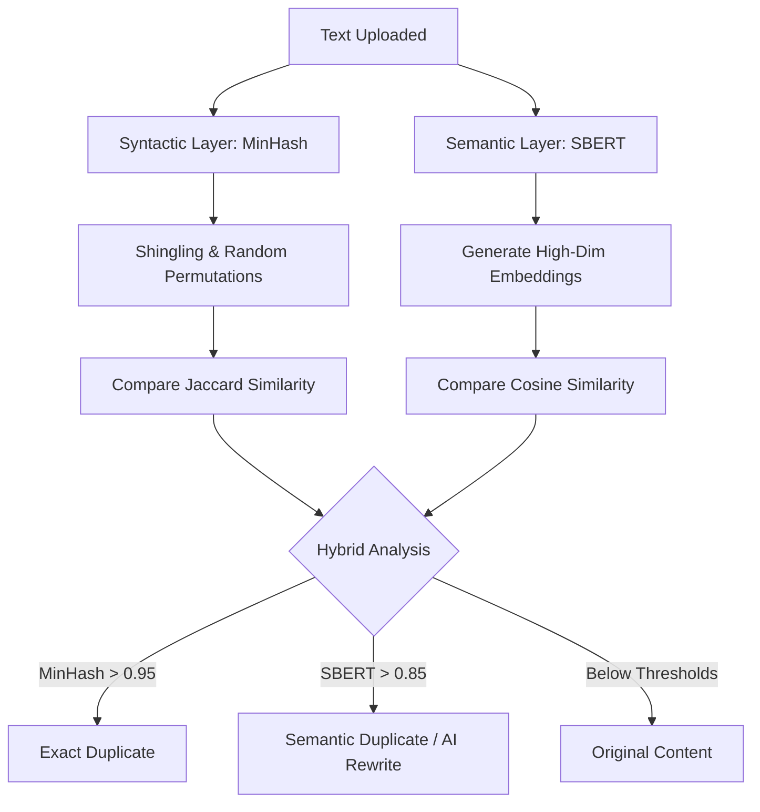
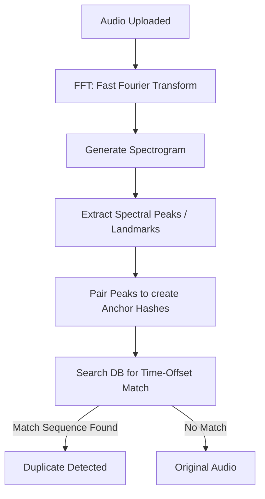
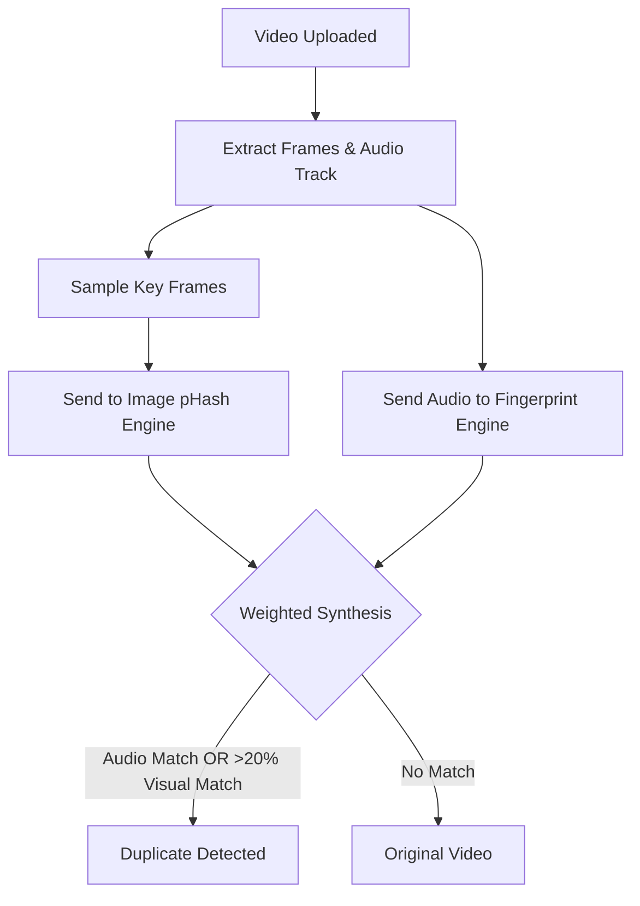
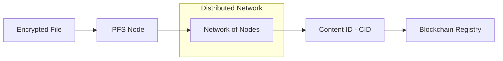
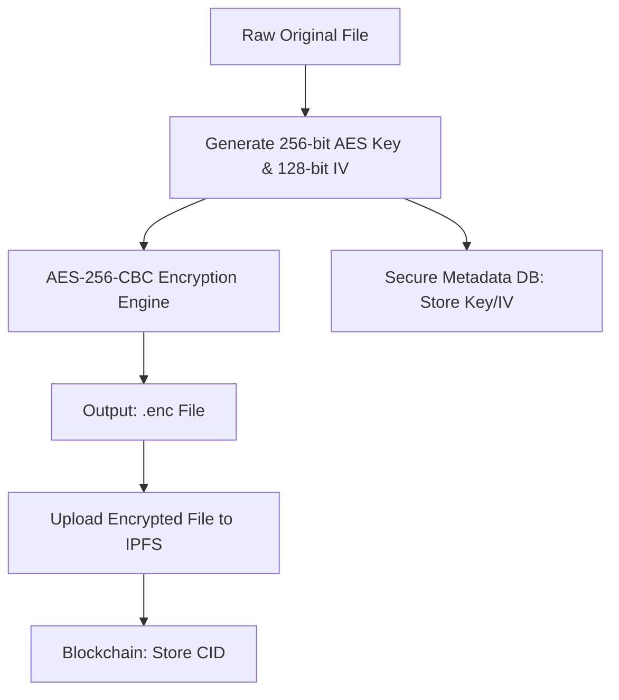
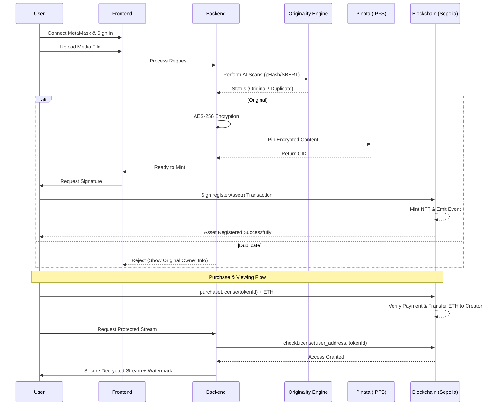

# Presentation Guide: Blockchain-Based Digital Rights Management (DRM)

## 1. Introduction: Digital Assets & DRM
### What are Digital Assets?
Digital assets are any content stored in binary format that comes with a right to use. This includes Media (Photos, Video, Audio), Documents (Research, Code), and Art (Illustrations, 3D).

### What is DRM (Digital Rights Management)?
DRM is a systematic approach to copyright protection. It prevents unauthorized redistribution and restricts how users can copy content they've purchased. Traditional DRM is centralized; our solution is **Decentralized**.

## 2. The Problem: Crisis Without This Solution
*   **Illegal Downloads**: Content is stolen and re-uploaded instantly.
*   **Modification Fraud**: Pirates slightly rotate images or paraphrase text to bypass simple hash checks and claim "original" ownership.
*   **Lack of Provenance**: In an AI-heavy world, it's impossible to know who created a file first.

## 3. Proposed Solution: Hybrid Intelligence
A system merging **AI Originality Checks** (for uniqueness) with **Blockchain** (for ownership) and **IPFS** (for storage).

---

> [!IMPORTANT]
> **Live Testnet Deployment**: The smart contracts are now deployed to the **Sepolia Testnet**. You no longer need to run a local Hardhat node. Follow the [Execution Guide](file:///C:/Users/Sai%20Krishna/.gemini/antigravity/brain/3f428e78-cc06-44be-963a-e30efffee394/execution_guide.md) for updated instructions.

---

## 📋 Prerequisites

### A. Image Originality (Perceptual Hashing - pHash)
Unlike cryptographic hashes, pHash remains stable even if an image is resized or rotated.

### B. Text Originality (MinHash + SBERT)
A dual-layer approach for syntactic and semantic detection.

### C. Audio Originality (Spectral Fingerprinting)
Analyzes the audio spectrum to find unique "landmarks."

### D. Video Originality (Multi-Modal Synthesis)
Cross-engine validation of visuals and sound.

---

## 5. Blockchain: The Trust Layer
### What is it?
A decentralized ledger where every "Asset Registration" is an immutable transaction.
### Why use it?
*   **Decentralization**: No single company controls the rights.
*   **Immutability**: Once registered, ownership cannot be forged.
*   **Smart Contracts**: Programmable licenses that auto-execute payments.
### How it works?
We use the **Ethereum Sepolia Testnet**. Assets are treated as **ERC-721 NFTs**.
*   **Smart Contract 1 (Registry)**: Mints the NFT with the file's CID.
*   **Smart Contract 2 (Licensing)**: Manages four tiers of licenses and handles ETH transfers.

## 6. Ethereum & MetaMask: The Currency & Gateway
### Ethereum (ETH)
The native currency of the Ethereum blockchain. In our system, **ETH** is used for:
*   **Gas Fees**: Small payments to the network to process registrations and minting.
*   **License Payments**: Direct Peer-to-Peer (P2P) transfers from buyers to creators. 
*   **Smart Assets**: ETH allows for "Programmable Money," where payment and access are bundled in a single transaction.

### MetaMask
MetaMask is our "Digital Identity." It allows creators to:
1.  **Sign Transactions**: Verify they are who they claim to be.
2.  **Authorize Payments**: Send ETH securely without intermediaries.
3.  **Manage Ownership**: Prove ownership of an asset by holding the private key to the NFT.

## 7. IPFS & Pinata: Decentralized Storage
### What is IPFS?
A peer-to-peer protocol for storing and sharing data in a distributed file system. It uses **Content Addressing** (CIDs) rather than URLs. 

### Decentralized Storage Flow

### What is Pinata?
A pinning service that ensures our content remains available on the global IPFS network at all times, preventing it from being "garbage collected" if not recently accessed.

---

## 8. Encryption: The AES-256 Protocol
We use the **AES-256-CBC (Advanced Encryption Standard)**, the global gold standard for data security.

*   **Internal Working**: AES breaks data into 128-bit blocks and applies multiple rounds of substitution and permutation using the key. CBC (Cipher Block Chaining) ensures that identical blocks of data result in different encrypted outputs, making it immune to pattern analysis.

---

## 9. Full Project Life-Cycle (End-to-End Flow)

| Component | Responsibility |
| :--- | :--- |
| **On-Chain Data** | TokenID, CID (Content Hash), Creator Address, License Sales. |
| **Off-Chain Data** | JSON Metadata (Title, etc.), Encrypted Media File, AI Fingerprints. |

### Complete Flow Diagram

---

## 10. Comprehensive Test Results Table

| Asset Type | Modification | Detection Method | Status | Result Detail |
| :--- | :--- | :--- | :--- | :--- |
| **Image** | 90° Rotation | pHash (Multi-angle) | **Duplicate** | Exact Match at 90° |
| **Image** | 50% Crop | Quadrant Segmentation | **Duplicate** | Partial Segment Match |
| **Image** | Mirror/Flip | Flip Check | **Duplicate** | Mirrored Hash distance = 0 |
| **Image** | Color Inversion | pHash (Frequency) | **Duplicate** | Frequencies remain stable |
| **Text** | Paraphrased (AI) | SBERT (Semantic) | **Duplicate** | Semantic Score > 0.90 |
| **Text** | Minor Edits | MinHash (Syntactic) | **Near Duplicate** | 80% overlap detected |
| **Audio** | Background Noise | Peak Extraction | **Duplicate** | Core landmarks survived |
| **Video** | Muted Version | Visual Frame Check | **Duplicate** | 95% Frame similarity |

---

## 11. Real-World Impact
1.  **Stop AI Scraping**: Creators can now prove their work was registered *before* an AI model scraped it.
2.  **Instant Global Royalties**: Zero-middleman payments.
3.  **Digital Provenance**: A permanent record of history for every digital creation.

## 12. Conclusion: The Future of Creator Economy
By combining the **Immutability of Blockchain**, the **Scalability of IPFS**, and the **Intelligence of AI**, this project builds a foundation for a fairer digital world. 
*   **Creators** regain control and receive instant payments.
*   **Users** gain verifiable access and permanent licenses.
*   **Piracy** is deterred not just by law, but by robust, automated code.
This is more than a tool; it is a protocol for trust in the digital age.
